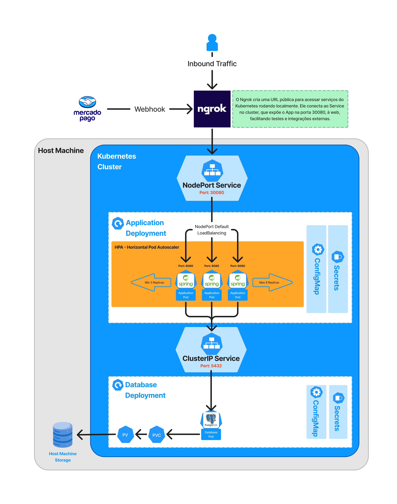

# O Problema

A lanchonete está enfrentando um alto número de requisições devido ao aumento da demanda. 
Para lidar com essa carga e garantir alta disponibilidade e escalabilidade, 
foi implementado um cluster Kubernetes (K8s) preparado para fazer o autoscaling dos PODs com HPA.

---

# Diagrama da Arquitetura Kubernetes



---

# Como executar este projeto

### Requisitos
1. WSL no Windows
2. Docker
3. Docker Desktop
4. Kubernetes
5. Helm
6. Ngrok
6. (Opcional) Lens

---
### 1. (Opcional) Configurando e Executando o Ngrok + Integração Mercado Pago
OBS: Esse passo somente é necessário caso deseje testar a integração com o Mercado Pago e Webhook

O **Ngrok** é utilizado para expor localmente sua aplicação rodando no Kubernetes para um endereço público na internet. Esse passo é necessário apenas se você deseja testar a integração com o **Mercado Pago** e os **webhooks** do sistema.

#### Por que usar o Ngrok?

Quando você está desenvolvendo em um ambiente local (como Kubernetes em sua máquina), o Mercado Pago precisa enviar notificações para sua aplicação por meio de webhooks. Porém, como o ambiente local não é acessível publicamente, o **Ngrok** resolve essa limitação, criando um túnel seguro que expõe sua aplicação por meio de uma URL pública temporária.

#### Passos para usar o Ngrok:

1. Instale o **Ngrok** no seu sistema, se ainda não tiver:
   - [Download Ngrok](https://ngrok.com/download)

2. Execute o comando abaixo para expor o serviço da aplicação (assumindo que o Kubernetes está rodando na porta `30080`):

   ```sh
   ngrok http 30080

3. O Ngrok gerará uma URL pública (como https://abc123.ngrok.io). Use essa URL para configurar a integração com o Mercado Pago no campo NOTIFICATION_URL.

4. Substitua as variáveis de ambiente no arquivo infra/values.yaml com os valores gerados:
- **`ACCESS_TOKEN_MERCADO_PAGO`**: O token de acesso gerado pela sua conta do Mercado Pago.
- **`NOTIFICATION_URL_NGROK`**: A URL pública gerada pelo Ngrok, como `https://abc123.ngrok.io`.

Recursos úteis para integração:
https://github.com/dannevesdantas/poc-mercadopago

[Documentação oficial e exemplos do Mercado Pago:](https://www.mercadopago.com.br/developers/en/docs)


### 2. Construir a Imagem Docker

```sh
docker build -t tech-challenge-fase-1 .
```

### 3. Aplicar todos os Manifests do Aplicativo no Kubernetes

```sh
helm install fiap-tech-challenge ./infra
```

### 4. Testar o aplicativo

```sh
curl -X GET "localhost:30080/customers"
```

### 5. Instalar o Kubernetes Metrics Server

O Metrics Server é necessário para que o Horizontal Pod Autoscaler (HPA) funcione corretamente.

```sh
kubectl apply -f https://github.com/kubernetes-sigs/metrics-server/releases/latest/download/components.yaml
```

---

### Executando contêineres Docker

1. Acesse a pasta onde o arquivo `docker-compose.yml` está localizado.
2. Execute o comando:

```sh
docker compose up -d
```

---

### Acessando a documentação OpenAPI/Swagger

1. Abra o URL no seu navegador:

```sh
http://localhost:30080/swagger-ui/index.html
```
