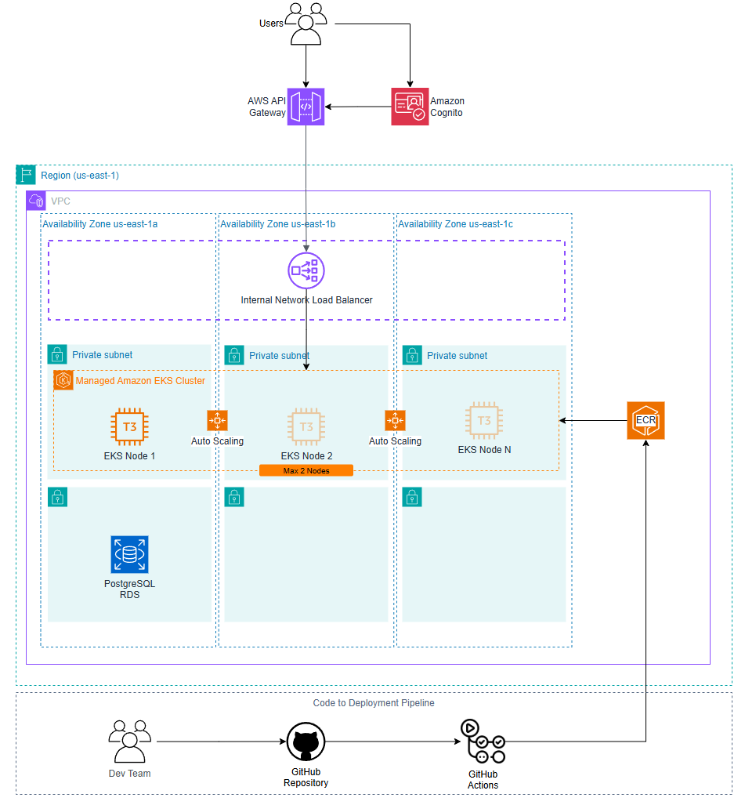

# Tech Challenge - Fase 3

A lanchonete, antes um negócio de bairro, está passando por um processo de expansão devido ao seu grande sucesso. 
No entanto, o crescimento acelerado trouxe desafios operacionais, especialmente no controle de pedidos. 
Sem um sistema digital, os pedidos eram anotados manualmente, o que gerava confusão entre os atendentes e a cozinha, 
além de atrasos e erros no atendimento.

Para resolver esse problema e garantir uma operação eficiente em escala, 
foi desenvolvida uma aplicação moderna baseada em microsserviços, 
utilizando EKS (Elastic Kubernetes Service) da AWS. 
A infraestrutura é provisionada via Terraform, 
e o processo de deploy é automatizado com GitHub Actions. 
As imagens de contêiner da aplicação são armazenadas no Amazon ECR.

---

## Arquitetura de Infraestrutura



- Os usuários acessam a aplicação por meio do **AWS API Gateway**, com autenticação gerenciada pelo **Amazon Cognito**.
- O tráfego autenticado é direcionado para um **Internal Network Load Balancer**, que distribui as requisições entre os nós do cluster.
- O cluster é composto por múltiplos nós EC2 do tipo T3, gerenciados pelo **Amazon EKS**, distribuídos em diferentes zonas de disponibilidade para garantir alta disponibilidade.
- O escalonamento dos nós é feito automaticamente com base na carga de trabalho.
- A aplicação interage com um banco de dados **PostgreSQL** hospedado no **Amazon RDS**.
- O processo de integração e entrega contínua (CI/CD) é realizado via **GitHub Actions**, que constrói a imagem da aplicação e publica no ECR.

---

## Repositórios do Projeto

##### fiap-soat-tech-challenge-fase-3-infra-terraform:
https://github.com/dequevedo/fiap-soat-tech-challenge-fase-3-infra-terraform

##### fiap-soat-tech-challenge-fase-3-db-terraform:
https://github.com/RenatoMartinsXrd/fiap-soat-tech-challenge-fase-3-db-terraform

##### fiap-soat-tech-challenge-fase-3-lambda:
https://github.com/RenatoMartinsXrd/fiap-soat-tech-challenge-fase-3-identify-customer-lambda

##### fiap-soat-tech-challenge-fase-3-app:
https://github.com/dequevedo/fiap-soat-tech-challenge-fase-3-app

---

## Como executar este projeto

O deploy da aplicação é dividido em 4 repositórios. Cada um possui uma pipeline que roda automaticamente ao mesclar um PR na branch main. 
A execução deve seguir a ordem abaixo:

### Repositório infra-terraform
Provisiona a infraestrutura base na AWS, incluindo VPC, subnets, cluster EKS, roles e policies necessárias.

### Repositório db-terraform
Provisiona o banco de dados gerenciado (PostgreSQL via RDS) e suas configurações de acesso.

### Repositório lambda
Realiza o deploy da função Lambda responsável por identificar o cliente com base no CPF, integrada ao API Gateway e Cognito.

### Repositório app
Constrói e publica a imagem da aplicação no ECR, e realiza o deploy da aplicação no cluster EKS usando Helm.

---

### Atualizando as definições do Kubernetes manualmente

```sh
helm install fiap-tech-challenge ./infra
```

Ou, caso queira atualizar a aplicação:

```sh
helm upgrade --install fiap-tech-challenge ./infra
```

---

## Testando a aplicação
